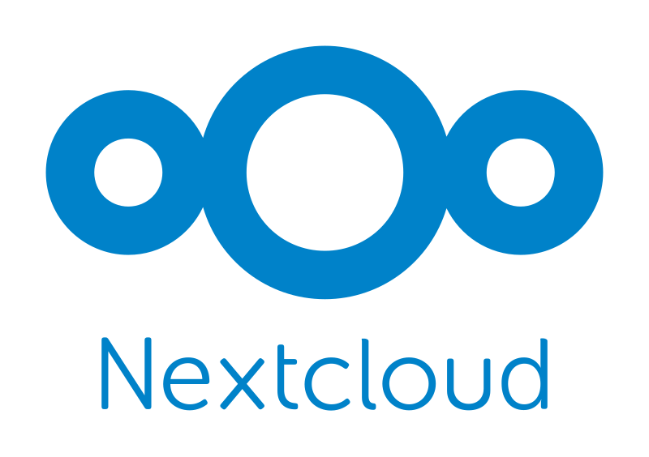

# Nextcloud Plus

Nextcloud Plus is a custom nextcloud docker image based on the official nextcloud image. This image includes additional packages commonly used in nextcloud installations.

<div align="center">
  

[](https://github.com/atb00ker/docker-nextcloud-plus)
[](https://github.com/atb00ker/docker-nextcloud-plus/actions)
[](https://hub.docker.com/r/atb00ker/nextcloud)
[](https://hub.docker.com/r/atb00ker/nextcloud)
[](./LICENSE)

</div>

## Key Features

- **FFmpeg**: Facilitates video processing.
- **ImageMagick**: Offers advanced image manipulation.
- **SMBClient/Samba Client**: Enables integration with Samba file shares.
- **IMAP Support**: Configures the IMAP PHP extension for email functionalities.
- **PHP Extensions**: Ensures installation of all necessary PHP extensions and their runtime dependencies.

The inspiration for the docker image comes from [an official example](https://github.com/nextcloud/docker/blob/master/.examples/dockerfiles/full/fpm/Dockerfile).

## GitHub Actions Workflow

The GitHub Actions workflow automates the building and deployment of the image to the Docker Hub registry. It runs every Saturday at 8:00 AM, ensuring the image with the latest tag aligns with the most recent Nextcloud version. If you use an automatic docker image update tool like [watchtower](https://github.com/containrrr/watchtower), be aware of this update schedule.

### Image Manual Update

```bash
docker build -f ./Containerfile -t atb00ker/nextcloud:latest ./
docker push atb00ker/nextcloud:latest
```
